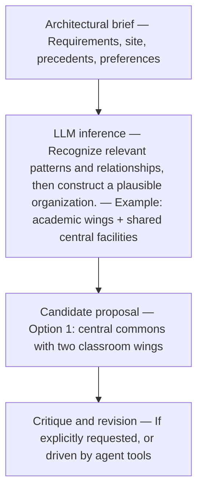
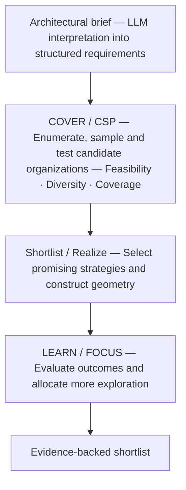
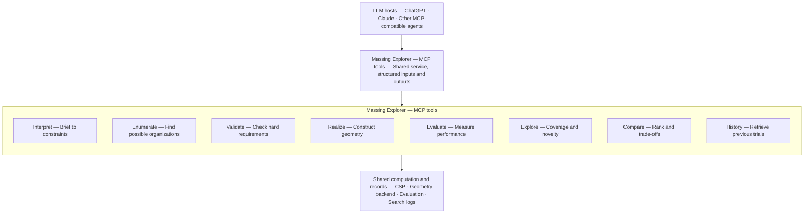
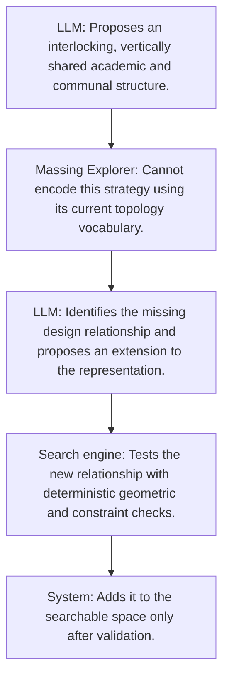

# Massing Explorer 2.0

Before changing direction, I want to separate three questions:

1. How does an LLM actually develop architectural proposals? Is it reasoning, sampling, or searching?
2. Which parts of my pipeline genuinely outperform an LLM? Especially COVER, CSP, LEARN, and FOCUS.
3. What should I build? A standalone engine, a collection of tools for ChatGPT/Claude, or a hybrid?

## 1. How LLM proposals differ from my pipeline

Imagine the brief:

Design a school with three masses, three floors maximum, gym and dining together, and admin on the ground floor.

### A. How an LLM might approach it

An LLM doesn't normally enumerate architectural alternatives internally and rank them systematically.

Instead, it generates an answer conditioned on the brief, its learned representations, instructions, and the conversation context.

A simplified conceptual example:

An important distinction: an LLM can perform deliberative reasoning, propose alternatives, use external tools, and revise its own results. But its hidden internal reasoning is not a directly inspectable, reproducible architectural search history. I can study its observable outputs and tool actions, not claim to know every internal step.

### B. My pipeline works differently

My pipeline explicitly maintains a population of candidates, records their characteristics, and uses those results to allocate further computational effort.

The fundamental difference:

- An LLM tends to construct proposals from learned knowledge and contextual reasoning, unless explicitly equipped with search.
- Massing Explorer constructs proposals by exploring a defined representational space using explicit search and evaluation procedures.

Neither is inherently better.

An LLM might propose a brilliant arrangement my representation excludes. My program might discover an excellent but unintuitive arrangement the LLM repeatedly overlooks.

And that's exactly what I should investigate.

## 2. The experiment I will run

I propose four experimental groups, not three. The fourth is important because I want to distinguish the value of my tools from the value of my search intelligence.

### The four competitors

#### A — Pure LLM

Receives the brief and generates architectural strategies through conversation and reasoning. No specialized massing tools.

Tests the baseline intelligence of the model.

#### B — LLM + computational tools

LLM can call CSP validators, generate geometry, inspect results, and query previous proposals. It decides what to explore next.

Tests what happens when an LLM controls the exploration.

#### C — Current Massing Explorer

My structured sampling, CSP shortlisting, realization, and exploration/refinement.

Tests the existing algorithmic pipeline.

#### D — Hybrid LLM + Massing Explorer

LLM proposes new strategies, critiques the design space, and requests targeted exploration. My engine handles systematic coverage, realization, validation, and comparison.

Tests whether the two systems actually complement each other.

### Three stages of testing

### Stage 1 — Understand how LLMs explore

Start with the exact school brief I'm already using.

Ask ChatGPT and Claude independently to develop 20 substantially different architectural organizations.

But instead of simply requesting a list, use a structured experimental protocol:

- Propose one strategy at a time.
- Explain its architectural rationale.
- State what makes it different from earlier proposals.
- Identify requirements it may violate.
- Choose what kind of strategy to investigate next.

I would record the observable sequence of proposals, explanations, revisions, and tool calls.

Then I would map all proposals to my nine strategy axes, where possible.

What I'd want to discover:

- Do LLMs repeatedly gravitate toward certain program organizations?
- Do they proactively explore substantially different families?
- Do they recognize gaps in their own proposals?
- Do they invent organizational principles missing from my CSP taxonomy?
- How often do they confidently propose infeasible solutions?

One especially important technique: repeat the experiment across independent runs. A single conversation doesn't establish the model's exploration tendencies.

### Stage 2 — Compare search performance

Run A, B, C, and D on the same briefs.

For a useful pilot, I'd choose three briefs:

| Brief | Purpose |
| --- | --- |
| 1. Existing Prompt B | Baseline; I already know where my pipeline struggles |
| 2. Tight constraints | Test constraint reasoning and feasible-region discovery |
| 3. Unusual spatial requirements | Test whether my representation limits creativity |

Control the experiment carefully:

- Same requirements and reference information.
- Same geometry/evaluation backend for B, C, and D.
- Equal budget, measured by both wall-clock time and actual computational cost.
- Separate fresh runs with no shared exploration history.
- Repeated trials: ideally 10 per system/brief, after a smaller pilot.
- Same output format: at most 10 final candidate strategies.

For fairness, B should have access to the same underlying solver primitives as C and D, but not the prepackaged COVER/LEARN/FOCUS controller. That isolates the value of the search policy.

A should be treated as a text-only baseline, with the same external validator applied afterward.

### Stage 3 — Evaluate independently

I would not let the participating LLM grade its own proposals.

| Metric | Measurement |
| --- | --- |
| Hard feasibility | Independent constraint verification |
| Distinct strategies | Unique configurations and distances in strategy space |
| Coverage | Breadth across feasible organizational families |
| Architectural quality | Blinded expert review |
| Best-design quality | Highest-rated final proposal |
| Search efficiency | Cost and time to discover useful valid strategies |
| Unexpected discoveries | Valuable proposals outside my current encoding |

I would also add coverage confidence: how much of the known or estimated feasible space did each system investigate?

This is tricky because I don't know the entire design space. For a limited benchmark, I can exhaustively enumerate a reduced CSP space and use that as ground truth. For the full brief, use a pooled reference set and report coverage as an estimate, not a completeness guarantee.

### What would convince me?

If B approaches C's performance, my elaborate search controller may not justify its complexity.

If D substantially beats B and C, that supports a hybrid.

If A produces consistently better architectural ideas than all the structured approaches, my representation or evaluation criteria may be restricting design intelligence.

A negative result would be valuable. I should design the experiment to potentially invalidate the project rather than merely demonstrate that my pipeline works.

## 3. What should I build for ChatGPT and Claude?

I would strongly favor modular tools over a monolithic plugin.

I can make a library of small architectural capabilities, accessible through the Model Context Protocol (MCP).

This is technically realistic today. OpenAI supports MCP-powered ChatGPT plugins with optional interfaces; Claude supports custom remote MCP connectors, and Claude Desktop also supports local MCP servers. 

Here's the architecture I'd investigate.

Not all these tools need to exist initially.

I'd start with just four.

| Initial tool | Why |
| --- | --- |
| validate_strategy() | Check whether the LLM's proposal is actually feasible |
| realize_strategy() | Convert it into measurable geometry |
| explore_alternatives() | Return distinct, feasible alternatives or identify underexplored regions |
| compare_strategies() | Report trade-offs using consistent criteria |

This creates a crucial separation.

The LLM owns the architectural reasoning. My programs provide evidence and computational capabilities.

And unlike a giant agent-specific workflow, the same code can serve ChatGPT, Claude, a future interface, or my independent engine.

## 4. The more interesting idea: let the LLM challenge my search space

I think this is where the research could become genuinely novel.

Currently, my CSP space is largely predetermined. I intelligently explore combinations within that space.

But suppose Claude proposes a school organization that cannot be expressed using my existing partition or topology representation.

Instead of rejecting it, the system could identify the mismatch.

For example:

This suggests two levels of exploration:

- Within-space search: Finding better configurations inside a known architectural strategy space.
- Space-expanding search: Discovering architectural strategies my current representation cannot express.

The second is arguably closer to architectural creativity.

It would also give my three-axis system a much stronger purpose: not just evaluating candidates, but helping assess where the current search space is incomplete.

There's one caveat. Automatically changing the strategy representation risks destroying consistency. I would require explicit schema versioning and human approval before new organizational types enter the main search.

## 5. My recommended development sequence

I would not immediately invest in a polished ChatGPT or Claude plugin. First, I should establish whether the individual tools produce measurable value.

### 01 — Build a shared benchmark

Freeze the existing version of Massing Explorer. Establish inputs, evaluation criteria, output schemas, and detailed search logs. Record every candidate and why it was accepted, rejected, or revisited.

### 02 — Run pure LLM experiments

I will let ChatGPT and Claude independently explore the same briefs. Analyze their observed strategies, repetitions, blind spots, validity, and discoveries outside my representation.

### 03 — Extract a small computational toolkit

Make CSP validation, realization, alternative exploration, and comparison callable independently of the full pipeline.

### 04 — Expose the toolkit through MCP

Connect it to Claude and ChatGPT where the account and developer capabilities permit. Use the same backend for both to compare agent behavior fairly.

### 05 — Run all four experimental groups

Determine which tools help, which orchestration policies help, and whether anything in the existing pipeline should be abandoned.

A practical consideration: ChatGPT and Claude offer somewhat different integration and permission models, so the MCP adapter should remain thin and host-independent. I should not tie the research to features exclusive to one chat interface
