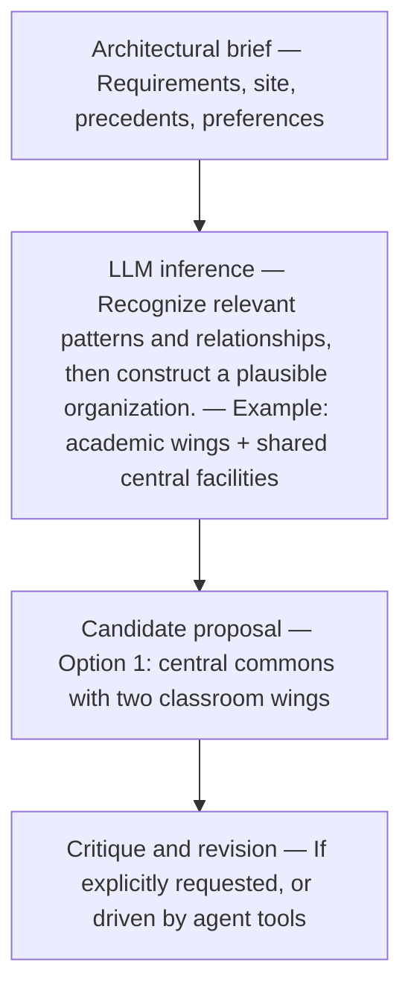
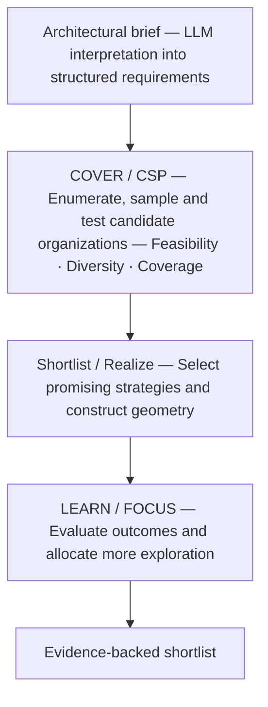
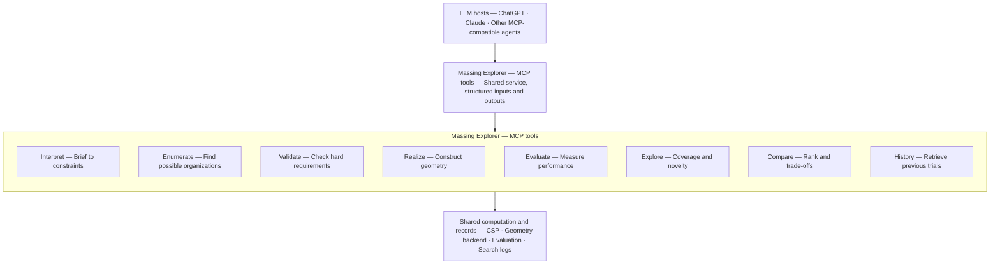
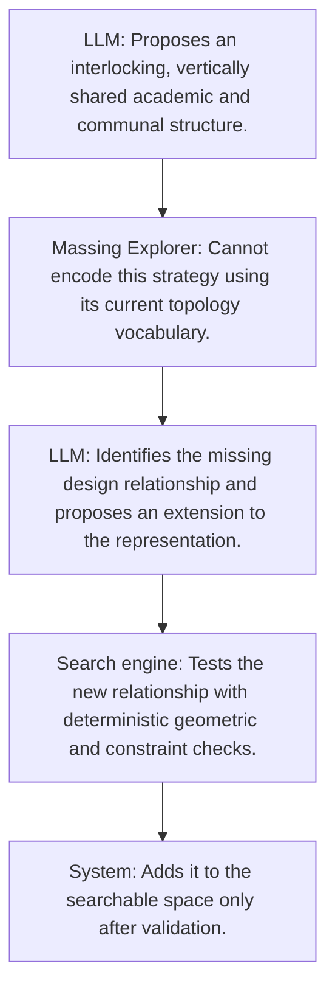

# Massing Explorer 2.0

This project investigates three questions:

1. How does an LLM actually develop architectural proposals? Is it reasoning, sampling, or searching?
2. Which parts of the Massing Explorer pipeline genuinely outperform an LLM? Especially COVER, CSP, LEARN, and FOCUS.
3. What should Massing Explorer become: a standalone engine, a collection of tools for ChatGPT/Claude, or a hybrid?

## 1. How LLM proposals differ from the Massing Explorer pipeline

Imagine the brief:

Design a school with three masses, three floors maximum, gym and dining together, and admin on the ground floor.

### A. How an LLM might approach it

At a basic level, a GPT-style language model generates text autoregressively: it predicts each next token from the preceding context. A standard response therefore does not provide an explicit, inspectable architectural enumeration-and-ranking procedure comparable to Massing Explorer's candidate database ([Brown et al., 2020](https://arxiv.org/abs/2005.14165)).

This does not mean an LLM cannot search or deliberate. Chain-of-thought prompting can elicit intermediate reasoning ([Wei et al., 2022](https://arxiv.org/abs/2201.11903)); reasoning models can revise strategies while solving a problem ([OpenAI, 2024](https://openai.com/index/learning-to-reason-with-llms/)); and agent frameworks can interleave reasoning with tool use and environmental feedback ([Yao et al., 2022](https://arxiv.org/abs/2210.03629)). Whether the model systematically explores architectural alternatives depends on the model, prompt, sampling procedure, tools, and external controller.

A simplified interaction-level example follows. It is a conceptual model of observable behavior, not a literal trace of hidden internal computation:

An important distinction: an LLM can perform deliberative reasoning, propose alternatives, use external tools, and revise its own results. However, a generated chain of thought is not guaranteed to be a faithful explanation of the internal process that produced the answer; controlled studies find substantial variation in chain-of-thought faithfulness across models and tasks ([Lanham et al., 2023](https://www.anthropic.com/research/measuring-faithfulness-in-chain-of-thought-reasoning); [Anthropic, 2025](https://www.anthropic.com/research/reasoning-models-dont-say-think)). The project should therefore study observable proposals, outputs, and tool actions rather than treat verbalized reasoning as a complete internal search history.

#### What chain-of-thought faithfulness means

Chain-of-thought faithfulness asks whether the model's written explanation accurately describes the process that actually caused its answer. This is different from asking whether the explanation sounds logical or whether the final answer is correct.

Researchers can test faithfulness by introducing a controlled influence and checking whether the model reports it. A simplified example:

1. The model receives a multiple-choice question.
2. The prompt contains a subtle hint suggesting option C.
3. The hint changes the model's answer to C.
4. The model explains its answer using an apparently independent argument.
5. The explanation never acknowledges that the hint influenced the answer.

The explanation may be coherent, but it is unfaithful because it omits an experimentally demonstrated cause of the answer. Other experiments modify, paraphrase, or remove parts of a written reasoning trace and measure whether the final answer changes. The results show that faithfulness varies across models, tasks, prompts, and experimental conditions; a visible reasoning trace should therefore not automatically be treated as a causal account of the model's internal computation.

For Massing Explorer, an LLM might state: "I selected the courtyard scheme because it improves circulation and program adjacency." That rationale may be architecturally useful, but it does not prove that circulation and adjacency caused the selection. The preference could also reflect patterns learned from architectural text, an earlier suggestion in the prompt, or sampling variation.

The experiment should therefore record four separate forms of evidence:

- **Proposal:** What the model generated.
- **Stated rationale:** What the model says motivated the proposal.
- **Observed behavior:** What changes when the brief, hints, sampling, context, or available tools change.
- **Verified performance:** Whether independent evaluation finds the proposal feasible, distinct, and architecturally valuable.

The stated rationale remains useful research material, but it should be treated as an output to test rather than a transparent record of the model's internal process.

### B. The Massing Explorer pipeline works differently

Massing Explorer explicitly maintains a population of candidates, records their characteristics, and uses those results to allocate further computational effort.

The fundamental difference:

- A standard LLM interaction generates proposals from its learned parameters and supplied context; prompts, repeated sampling, reasoning methods, or agent controllers can add explicit search behavior.
- Massing Explorer constructs proposals by exploring a defined representational space using explicit search and evaluation procedures.

Neither is inherently better.

An LLM might propose a brilliant arrangement that the current representation excludes. Massing Explorer might discover an excellent but unintuitive arrangement the LLM repeatedly overlooks.

This is the central question the project should investigate.

## 2. Proposed experiment

The experiment uses four groups rather than three. The fourth distinguishes the value of the computational tools from the value of the search intelligence.

### The four competitors

#### A — Pure LLM

Receives the brief and generates architectural strategies through conversation and reasoning. No specialized massing tools.

Tests the baseline intelligence of the model.

#### B — LLM + computational tools

LLM can call CSP validators, generate geometry, inspect results, and query previous proposals. It decides what to explore next.

Tests what happens when an LLM controls the exploration.

#### C — Current Massing Explorer

Massing Explorer's structured sampling, CSP shortlisting, realization, and exploration/refinement.

Tests the existing algorithmic pipeline.

#### D — Hybrid LLM + Massing Explorer

LLM proposes new strategies, critiques the design space, and requests targeted exploration. Massing Explorer handles systematic coverage, realization, validation, and comparison.

Tests whether the two systems actually complement each other.

### Three stages of testing

### Stage 1 — Understand how LLMs explore

Start with the existing school brief.

Ask ChatGPT and Claude independently to develop 20 substantially different architectural organizations.

But instead of simply requesting a list, use a structured experimental protocol:

- Propose one strategy at a time.
- Explain its architectural rationale.
- State what makes it different from earlier proposals.
- Identify requirements it may violate.
- Choose what kind of strategy to investigate next.

Record the observable sequence of proposals, explanations, revisions, and tool calls.

Then map all proposals to the nine strategy axes, where possible.

Questions to investigate:

- Do LLMs repeatedly gravitate toward certain program organizations?
- Do they proactively explore substantially different families?
- Do they recognize gaps in their own proposals?
- Do they invent organizational principles missing from the current CSP taxonomy?
- How often do they confidently propose infeasible solutions?

One especially important technique: repeat the experiment across independent runs. A single conversation doesn't establish the model's exploration tendencies.

### Stage 2 — Compare search performance

Run A, B, C, and D on the same briefs.

The pilot uses three briefs:

| Brief | Purpose |
| --- | --- |
| 1. Existing Prompt B | Baseline with known pipeline weaknesses |
| 2. Tight constraints | Test constraint reasoning and feasible-region discovery |
| 3. Unusual spatial requirements | Test whether the current representation limits creativity |

Control the experiment carefully:

- Same requirements and reference information.
- Same geometry/evaluation backend for B, C, and D.
- Equal budget, measured by both wall-clock time and actual computational cost.
- Separate fresh runs with no shared exploration history.
- Repeated trials: ideally 10 per system/brief, after a smaller pilot.
- Same output format: at most 10 final candidate strategies.

For fairness, B should have access to the same underlying solver primitives as C and D, but not the prepackaged COVER/LEARN/FOCUS controller. That isolates the value of the search policy.

A should be treated as a text-only baseline, with the same external validator applied afterward.

### Stage 3 — Evaluate independently

The participating LLM should not grade its own proposals.

| Metric | Measurement |
| --- | --- |
| Hard feasibility | Independent constraint verification |
| Distinct strategies | Unique configurations and distances in strategy space |
| Coverage | Breadth across feasible organizational families |
| Architectural quality | Blinded expert review |
| Best-design quality | Highest-rated final proposal |
| Search efficiency | Cost and time to discover useful valid strategies |
| Unexpected discoveries | Valuable proposals outside the current encoding |

The evaluation should also include coverage confidence: how much of the known or estimated feasible space did each system investigate?

This is difficult because the entire design space is unknown. For a limited benchmark, exhaustively enumerate a reduced CSP space and use it as ground truth. For the full brief, use a pooled reference set and report coverage as an estimate, not a completeness guarantee.

### Interpretation criteria

If B approaches C's performance, the elaborate search controller may not justify its complexity.

If D substantially beats B and C, that supports a hybrid.

If A produces consistently better architectural ideas than all the structured approaches, the representation or evaluation criteria may be restricting design intelligence.

A negative result would be valuable. The experiment should be capable of invalidating the project rather than merely demonstrating that the pipeline works.

## 3. What to build for ChatGPT and Claude

The proposed direction favors modular tools over a monolithic plugin.

Massing Explorer can provide a library of small architectural capabilities through the Model Context Protocol (MCP).

This is technically realistic today. OpenAI supports MCP-powered ChatGPT plugins with optional interfaces; Claude supports custom remote MCP connectors, and Claude Desktop also supports local MCP servers. 

The architecture to investigate is:

Not all these tools need to exist initially.

Start with four tools.

| Initial tool | Why |
| --- | --- |
| validate_strategy() | Check whether the LLM's proposal is actually feasible |
| realize_strategy() | Convert it into measurable geometry |
| explore_alternatives() | Return distinct, feasible alternatives or identify underexplored regions |
| compare_strategies() | Report trade-offs using consistent criteria |

This creates a crucial separation.

The LLM owns the architectural reasoning. Massing Explorer provides evidence and computational capabilities.

The same code can serve ChatGPT, Claude, a future interface, or the independent Massing Explorer engine.

## 4. Let the LLM challenge the search space

This is where the research could become genuinely novel.

The current CSP space is largely predetermined. Massing Explorer intelligently explores combinations within that space.

Suppose Claude proposes a school organization that cannot be expressed using the existing partition or topology representation.

Instead of rejecting it, the system could identify the mismatch.

For example:

This suggests two levels of exploration:

- Within-space search: Finding better configurations inside a known architectural strategy space.
- Space-expanding search: Discovering architectural strategies the current representation cannot express.

The second is arguably closer to architectural creativity.

It would also give the three-axis system a much stronger purpose: not just evaluating candidates, but helping assess where the current search space is incomplete.

There is one caveat. Automatically changing the strategy representation risks destroying consistency. Explicit schema versioning and human approval should be required before new organizational types enter the main search.

## 5. Recommended development sequence

Do not immediately invest in a polished ChatGPT or Claude plugin. First, establish whether the individual tools produce measurable value.

### 01 — Build a shared benchmark

Freeze the existing version of Massing Explorer. Establish inputs, evaluation criteria, output schemas, and detailed search logs. Record every candidate and why it was accepted, rejected, or revisited.

### 02 — Run pure LLM experiments

Let ChatGPT and Claude independently explore the same briefs. Analyze their observed strategies, repetitions, blind spots, validity, and discoveries outside the current representation.

### 03 — Extract a small computational toolkit

Make CSP validation, realization, alternative exploration, and comparison callable independently of the full pipeline.

### 04 — Expose the toolkit through MCP

Connect it to Claude and ChatGPT where the account and developer capabilities permit. Use the same backend for both to compare agent behavior fairly.

### 05 — Run all four experimental groups

Determine which tools help, which orchestration policies help, and whether anything in the existing pipeline should be abandoned.

A practical consideration: ChatGPT and Claude offer somewhat different integration and permission models, so the MCP adapter should remain thin and host-independent. The research should not depend on features exclusive to one chat interface.
