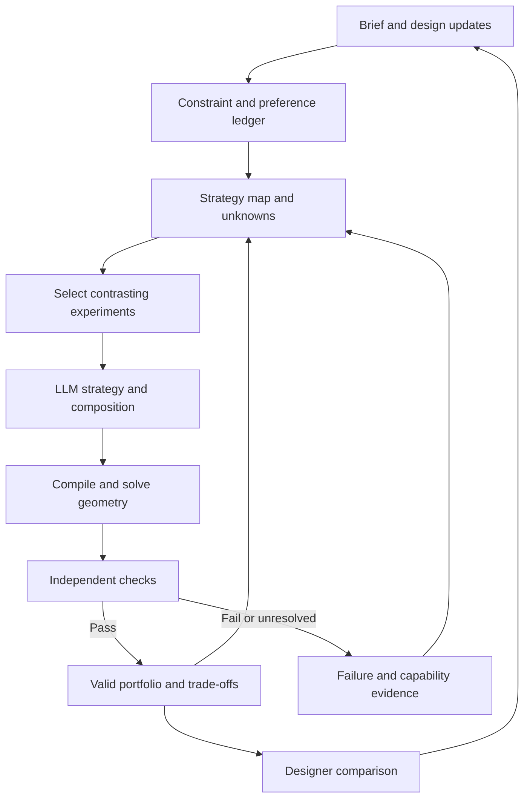

# Step 03 research review: an evolving strategy map for LLM–ME design

Research date: 2026-10-08. Original repository: [UsernameIsJoe/Massing-Explorer](https://github.com/UsernameIsJoe/Massing-Explorer), pinned at [cd4113fc642e81531f3a52908f5b3b390022dd86](https://github.com/UsernameIsJoe/Massing-Explorer/tree/cd4113fc642e81531f3a52908f5b3b390022dd86). Repository access confirmed; the head remained unchanged at the final repository check. This review uses the original implementation and primary research literature, not ME 2.0 as an architectural template or its pilot scores as evidence.

## Judgment

**The refined concept is technically plausible and worth testing, but its broad formulation is already substantially anticipated by prior work.** The potential research contribution is a semantic abstraction that connects architectural commitments, generative operations and measured evidence, and can be revised when the designer introduces a new concern. Neither improved search efficiency nor contribution-level novelty has yet been established for this implementation.

This revision evaluates the clarified proposal: cheaply represent broad possibilities, allocate expensive work to contextually relevant depth, preserve alternatives, and redirect through iterative user input. It does not interpret the proposal as claiming ME lacks computational iteration. The central risk is that a plausible semantic map becomes another biased shortlist and obscures the possibilities it suppresses.

Three changes would make the idea more precise:

- Call the pseudo sample space an **evolving strategy map**, or strategy atlas: a referenceable, incomplete model of alternatives and evidence. It can organize hypotheses without enumerating every design.
- Separate **what may be proposed**, **how alternatives are compared**, and **what can currently be validated**. Changing a descriptive map alone does not expand the generator or geometric backend.
- Let the LLM take greater responsibility for architectural composition and proposing realizations. Retain independent numerical and geometric checks, and use solvers for dimensions where useful. LLM-led realization and deterministic verification are compatible.

The relevant research supports pieces of this system. It does not establish that this particular combination will solve all five pain points, identify a globally best design, or understand the full architectural possibility space. The strongest competing explanation is that persistent diverse memory, retrieval and user-conditioned scheduling would deliver the same gains without a relational semantic map. Section 10 gives the critical assessment and tests that distinguish these explanations.

## 1. What the original ME actually does

I retrieved and inspected 35 source/document/input files at the pinned commit. Key implementation evidence follows. Links refer to the reviewed version, rather than a moving branch.

| Finding | Direct evidence | Implication |
|---|---|---|
| The pre-shortlist sampler already looks across the bounded partition space. Small spaces are enumerated; larger spaces use a stable, stratified proposal stream and descriptor regions. It protects a coverage share before brief-conditioned allocation. | [csp_landscape.py](https://github.com/UsernameIsJoe/Massing-Explorer/blob/cd4113fc642e81531f3a52908f5b3b390022dd86/src/massing_explorer/explore/csp_landscape.py), `build_partition_landscape` | The current limitation is not simply a lack of sampling machinery. Broad partition coverage can still miss useful architectural distinctions. Its partition-valid labels are not geometric feasibility certificates. |
| Initial-P shortlisting is a portfolio selector, not only a school-shaped ranking. It protects mass-count strata and uses marginal region/relationship coverage, partition distance, capacity plausibility and information value, with an archetype floor. | [csp.py](https://github.com/UsernameIsJoe/Massing-Explorer/blob/cd4113fc642e81531f3a52908f5b3b390022dd86/src/massing_explorer/explore/csp.py), `_pick_shortlist` | Adding another heuristic to this selector may have diminishing value if the representation and downstream realizations remain narrow. This is a hypothesis to test, not a proven cause of every disappointing result. |
| Strategy domains remain finite and explicit: two topologies, two loading modes, three envelope families and two plate-profile families. | [strategy_contract.py](https://github.com/UsernameIsJoe/Massing-Explorer/blob/cd4113fc642e81531f3a52908f5b3b390022dd86/src/massing_explorer/explore/strategy_contract.py) | Flexibility requires changing the design language or its compositional operators, not just sampling more combinations of existing labels. |
| The LLM planner sees a strategy contract, failures and up to eight empty-cell statements, but is limited to five typed actions. It may not invent dimensions; open partitions belong to CSP. | [planner.py](https://github.com/UsernameIsJoe/Massing-Explorer/blob/cd4113fc642e81531f3a52908f5b3b390022dd86/src/massing_explorer/explore/planner.py), `plan_context`, `parse_plan` | ME already has some LLM–archive interaction. The proposed step is a substantially richer interface and responsibility, rather than introducing an LLM for the first time. |
| Realize freezes partition, topology and stories, then searches an adaptive set of widths/projections with a maximum of 14 internal solves. It returns a legal result or the closest illegal result found. | [realize.py](https://github.com/UsernameIsJoe/Massing-Explorer/blob/cd4113fc642e81531f3a52908f5b3b390022dd86/src/massing_explorer/explore/realize.py), `realize` | A drop-in LLM width proposer would still inherit most of the strategic restrictions. If it changes partition or topology, it is also generating a new strategy and that branch must be recorded. |
| Courtyard, podium and perpendicular wings are explicitly unsupported. Paired bars require stated frontage. An L-shaped leftover around a double-height void is not general L-building support. | [topology.py](https://github.com/UsernameIsJoe/Massing-Explorer/blob/cd4113fc642e81531f3a52908f5b3b390022dd86/src/massing_explorer/explore/topology.py) | A richer textual map cannot make an unsupported topology drawable or checkable. Missing capability must be distinguished from architectural illegality. |
| ME already has COVER, REPAIR, planner/MCTS, sequential BO, REFINE, diagnostics and preference learning. P-pool expansion responds to failure, starvation and coverage gaps. | [controller.py](https://github.com/UsernameIsJoe/Massing-Explorer/blob/cd4113fc642e81531f3a52908f5b3b390022dd86/src/massing_explorer/explore/controller.py), [p_pool.py](https://github.com/UsernameIsJoe/Massing-Explorer/blob/cd4113fc642e81531f3a52908f5b3b390022dd86/src/massing_explorer/explore/p_pool.py) | The clarified research question concerns user-driven changes in design intent and representation, beyond the installed computational iteration. |
| Preference learning fits a Bradley–Terry utility over four fixed composites. Written explanations of why B is preferred are not additional coordinates. The behavior archive keeps one elite per cell, replacing it through the default architectural reward. | [preference.py](https://github.com/UsernameIsJoe/Massing-Explorer/blob/cd4113fc642e81531f3a52908f5b3b390022dd86/src/massing_explorer/explore/preference.py), [archive.py](https://github.com/UsernameIsJoe/Massing-Explorer/blob/cd4113fc642e81531f3a52908f5b3b390022dd86/src/massing_explorer/explore/archive.py), [saturate.py](https://github.com/UsernameIsJoe/Massing-Explorer/blob/cd4113fc642e81531f3a52908f5b3b390022dd86/src/massing_explorer/explore/saturate.py) | A user can change ranking within the represented objectives, but an architectural concern absent from those objectives is difficult to learn. Single-elite retention can discard an alternative useful under a later preference. |
| The nine named search dimensions are a projection of requested strategy, not a complete description of realized architecture. Internally the encoding is 74 values, including 66 pairwise ownership bits, limited to 12 departments. | [axes.py](https://github.com/UsernameIsJoe/Massing-Explorer/blob/cd4113fc642e81531f3a52908f5b3b390022dd86/src/massing_explorer/explore/axes.py) | Preserve useful human-readable descriptors, but do not treat this projection as the full generative space or an identity certificate. A synthetic component check confirmed the ownership block ignores a thirteenth department. That is not evidence of a failure in the present school brief. |

**Interpretation:** stiffness is an implementation/representation issue, not an inherent property of deterministic programming or CSP. CSP can enforce relations across a rich language; it does not supply architectural judgment automatically. The promising division is flexible proposal/formulation plus dependable accounting, validation and memory.

This was a source-level review, not a new full search benchmark. Existing work-status documentation reports focused shortlist tests and broader suite failures; those historical results were not reproduced here. No new comparative performance result is claimed.

## 2. The closest precedents and their limits

The following are primary papers or author/institutional records. The connections to ME are research interpretations. Published work and preprints are distinguished. The list is targeted, not an exhaustive systematic review.

| Precedent | What the work supports | What it does not establish for ME |
|---|---|---|
| **HOLLM — Improving LLM-based Global Optimization with Search Space Partitioning**, ICLR 2026 [S1] | Adaptive partitions and an external selection policy guide LLM proposals in promising and underexplored regions; experiments compare this against global LLM sampling. It is a close precedent for budget allocation through numerical regions. | Its KD-tree operates within an already specified domain. It does not invent an architectural grammar. The paper states that regret guarantees are lacking and proposal bias/cost remain limitations. |
| **In-context QD**, Lim, Flageat & Cully, 2024 [S2] | LLM proposals can use a diverse archive, feature descriptions and target niches. Ablations show that fitness-only prompting can reduce exploration, while context organization matters. | Results on optimization and robot-control tasks do not prove architectural quality. More context is not universally better, and a niche must still mean something measurable. |
| **QDAIF**, Bradley et al., 2023 [S3] | LLM generation and qualitative feedback can support archives of diverse, high-quality text. | Authors report possible evaluator reward hacking and dependence on chosen diversity axes. Good prose and new family names are insufficient evidence of good or diverse architecture. |
| **AURORA**, Grillotti & Cully, 2021/2022 [S4] | Diversity descriptors can be learned and updated during search instead of being entirely hand-coded. Existing archive members are re-encoded when the representation changes. | This is robotics evidence, not a turnkey semantic design map. A changing learned distance can undermine comparability; a small ME pilot may lack enough data for useful representation learning. |
| **AIDL — A Solver-Aided Hierarchical Language for LLM-Driven CAD Design**, Computer Graphics Forum, 2025 [S5] | A hierarchical language lets LLMs describe components and relationships while a constraint solver handles geometry; it supports editable results. The final publication evaluates 2D text-to-CAD. | It does not demonstrate fully validated 3D school massing. It supports LLM-led composition with solver support more directly than unverified coordinate generation. |
| **Co-Layout**, AAAI 2026 [S6] | Architectural layout can combine language-derived constraints with integer programming, including connectivity, accessibility and exclusivity in a coarse-to-fine formulation. | Interior layouts on a grid are a different problem from open architectural strategy discovery. The formulation still defines what can be expressed. |
| **LLM-based Formalized Programming**, ICLR 2025 [S7] | LLMs can formulate planning problems and use an optimizer, with evaluated improvements over direct planning on nine tasks. | Formalizing an incomplete brief incorrectly can still solve the wrong problem. It is not a guarantee of general architectural reasoning or global creativity. |
| **LLM-guided constraint-model reformulation**, July 2026 preprint [S8] | Diverse retained context and validation-based selection can improve iterative reformulation on eight CSPLib problems. | The paper checks returned solutions against the baseline; it does not prove full solution-set equivalence. One-model/solver limits and outlier-driven aggregate gains counsel against importing its numerical improvements into ME. |
| **A2DEPT**, ICML 2026 [S9] | Tree-based LLM evolution can revise complete algorithms beyond rigid component templates, with execution/repair feedback. | It searches algorithms, not buildings. Expanding architectural representation still needs executable geometry and validation semantics. |
| **Can LLMs explore in-context?**, NeurIPS 2024 [S10] | Experiments with older models found robust bandit exploration only under a particular configuration using external history summarization. | It is evidence for external support, not a verdict on every present-day LLM or on an inaccessible internal reasoning process. |

Two further foundations clarify the objective. MAP-Elites [S11] retains good solutions across descriptor niches; that is different from keeping only a Pareto front across performance objectives. Preference-exploration Bayesian optimization [S12] alternates learning user preferences and selecting new experiments. These support a portfolio responsive to the designer, without assuming one fixed universal ranking.

Dorst and Cross's design-process work [S13] supports considering changes in problem framing alongside solutions. It is descriptive design theory, not an optimization guarantee. CEGIS/sketching [S14] supplies a useful proposal–verification–revision pattern; a geometry checker returning failures does not automatically provide the proof guarantees of formal program synthesis.

**Novelty assessment:** combining LLMs, archives, adaptive search and solvers is established. A defensible contribution here would be the architectural representation and protocol: an evolving, inspectable strategy map that preserves constraint meaning, retains contextual alternatives, and supports branch revision across design updates. Its value should be demonstrated through controlled comparisons.

The refined proposal requires closer architectural and semantic precedents than a general optimization comparison alone:

| Direct precedent | Verified overlap | Remaining distinction to test |
|---|---|---|
| **User-Controlled MAP-Elites / UC-ME**, Sfikas, Liapis & Yannakakis, 2023 [S15] | Architectural layout generation with feasible/infeasible archives and a user-directed search window; artificial-user experiments include preference reversals. Targeted search improved preference relevance at the cost of global coverage. | Its tested descriptors and user criteria are fixed and aligned. New semantic concerns, explicit relational generation and nonlocal branch reopening need separate evidence. Adaptive descriptors are also discussed as future work, so adaptation alone is a weak novelty claim. |
| **TileGPT**, Gaier et al., GECCO 2024 [S16] | QD-generated architectural data paired with text labels train a language model; high-level proposals are completed through WFC constraint satisfaction. | This already connects language, samples and symbolic realization. Its tile language and feature conditioning are restricted; persistent relational updates under changing intent are not established by its experiments. |
| **GenAlign**, Choi, Seo & Hyun [S17] | An inspectable, updated visual knowledge graph binds designer semantics to reusable design properties. The institutional abstract reports reduced semantic drift in a study with 24 professional designers. | This is especially close to persistent semantic grounding. The accessible abstract does not establish ME-style search-budget allocation, validated massing portfolios or region-level generative operators. Full-text overlap assessment remains necessary before claiming novelty. |
| **Adaptation-guided case retrieval**, Smyth & Keane, 1996 [S18] | Choosing a design case using knowledge of how it can be adapted, rather than similarity alone, is a long-established case-based-design idea. | Typed adaptation relationships are not novel by themselves. A new mechanism must demonstrate improved generative coverage or adaptation under the present constraints. Only publisher summary material was accessible in this review. |

GenAlign's institutional record assigns the journal issue to January 2027; the article was already discoverable on the publisher site in this October 2026 search. This review treats it as accessible prior work and does not claim the 2027 issue has already appeared. No unavailable full-paper results are inferred from its abstract.

## 3. Make “pseudo sample space” operational

The map should be incomplete by design, but precise enough to reference. It needs three separate layers:

1. **A design language:** program ownership, mass/floor identities, connections, stacking, primitive geometry and composition operations. This determines what the generator/compiler can express. It may grow through versioned extensions.
2. **A descriptive map:** stable architectural facts plus optional new distinctions, grouping strategies into useful regions. Regions need not form a complete Cartesian grid or be mutually exclusive. Not every combination of descriptor values is physically possible.
3. **An evidence store:** all attempts, measured results, failures, unresolved assumptions, capability limits and lineage. It supports updates without rewriting history.

Start with interpretable records rather than a newly trained latent model. LLM embeddings could later assist retrieval or proposing distinctions, but text similarity alone is a poor certificate of architectural novelty or feasibility.

An initial map could use six to ten contrasting hypotheses derived from the brief, program relations and an independent symbolic probe: public integration versus separation, alternative whole-department adjacencies, vertical organization and circulation/loading choices. This is an illustrative prototype size, not a coverage guarantee. Do not multiply every axis into a huge grid or seed only familiar school archetypes. Give each hypothesis a precise predicate and a small opportunity to produce a witness; keep unknown alternatives visible.

CSP can remain a source of constraint-consistent witnesses and necessary exclusion bounds. It need not act as the single gatekeeper that first chooses a complete creative population. LLM proposals, symbolic witnesses and outside-map probes can all enter the same checked archive. Sound constraint propagation can eliminate contradictions; stylistic expectations belong in preferences and evidence, not hard pruning.

| A strategy-region record contains | Example meaning |
|---|---|
| Stable ID, definition and membership predicates | Civic programs share a mass with administration; academic remains in its own mass. |
| Architectural hypothesis | Shorter public-to-admin routes may be possible, subject to circulation checks. |
| Known exemplars and measured trade-offs | Validated geometry, areas, route proxies, floor organization and evaluation version. |
| Untested variations | Change loading, move whole departments, revise floor placement or test another connection. |
| Validation evidence | A candidate failed a length check; this does not prove the entire region impossible. |
| Capability evidence | A proposed geometry cannot yet be checked by the current backend. |
| Parent/alternative links | Which commitment this branch changes, and which earlier branch it can revisit. |
| Context and representation versions | The brief, program, preference and map state under which the evidence was produced. |

Keep validation and capability status separate. A candidate may be supported and failed, supported and passed, unsupported and unresolved, or not yet tested. “Ruled out” requires an actual proof or a stated hard rule that excludes the defined region. Repeated failed sampling is not such a proof.

The LLM can propose a new region, challenge an existing region definition, or generate a candidate outside known regions. The system admits those proposals provisionally and checks whether they create an architectural distinction, rather than a renamed copy. A region unsupported by geometry remains a hypothesis, not successful coverage.

To make this useful for the LLM, each generation request should include: the current constraint ledger; a small contrasting set of exemplars; one relevant failure; selected unexplored alternatives; an explicit target or question; and a request for the changed commitments and machine-readable candidate. The full archive remains outside the context window. Hidden chain-of-thought is neither required nor treated as evidence; assess observable proposals, branches and revisions.

## 4. A mathematical formulation

The following is a proposed formulation for ME, not an established convergence theorem.

Let the design context be

\[
c_t=(B_t,\mathrm{Program}_t,\mathrm{Site}_t,H_t,U_t),
\]

where \(B_t\) is the brief/interpretation ledger, \(H_t\) the explicitly specified hard constraints, and \(U_t\) the current preference model. Let a candidate be \(x=(s,d)\): an architectural strategy plus a concrete realization. The exact distinction between strategy and dimensions must be specified by the design language.

The conceptual feasible set is

\[
\mathcal F(c_t)=\{x\in\Omega:g_j(x,c_t)\leq0,\ h_k(x,c_t)=0\},
\]

where \(\Omega\) denotes the architectural universe under discussion. We do not enumerate or know that universe. The current executable grammar \(\mathcal G_t\) produces a language \(L(\mathcal G_t)\), which represents only part of it. The validated sample is

\[
\widehat{\mathcal F}_t=\{x\in A_t:\operatorname{Check}(x,H_t,v_t)=\mathrm{pass}\},
\]

where \(A_t\) contains evaluated candidates and \(v_t\) identifies the validator and its supported scope. Passing proves only the checks actually implemented and supplied with data. An unresolved required check prevents a claim of complete compliance.

The map groups candidates through descriptive predicates:

\[
R_{k,t}=\{x\in L(\mathcal G_t):p_{k,t}(\phi_{\mathrm{core}}(x),\phi_{\mathrm{extra},t}(x))=1\}.
\]

Stable descriptors preserve comparison; optional descriptors capture newly useful distinctions. The predicates may overlap and may leave candidates unclassified. That is acceptable if an explicit outside-map path remains available.

Generation can use a mixture of policies:

\[
q_t=\alpha_tq_{\mathrm{refine}}+\beta_tq_{\mathrm{underexplored}}+\gamma_tq_{\mathrm{outside\ map}},
\qquad \alpha_t+\beta_t+\gamma_t=1.
\]

The last term is an instruction/policy for new distinctions or alternatives outside current regions, not a claim to sample all unknown architecture. Nonzero weights alone do not guarantee useful coverage: each generator can remain biased or have zero support for valuable designs. Reserve actual evaluation opportunities for these roles and measure their outcomes.

For contextual choice, retain a performance vector \(f(x,c_t)\), with explicit definitions, measurement scope and units. A sampled Pareto set is

\[
\mathcal P_t=\{x\in\widehat{\mathcal F}_t:\nexists y\in\widehat{\mathcal F}_t\text{ with }f(y,c_t)\succeq f(x,c_t)\text{ and one strict improvement}\}.
\]

Use the designer's preference model to choose among the current valid archive:

\[
x_t^*\in\arg\max_{x\in\widehat{\mathcal F}_t}U_t(f(x,c_t)).
\]

This means best among evaluated, presently valid candidates under the specified context. It does not mean best over \(\Omega\). A diversity archive and a Pareto archive serve different purposes: preserve useful strategic niches and near-feasible stepping stones as well as current non-dominated designs. Do not discard all globally dominated designs; they may provide useful parents or become relevant after a context change.

For initial scheduling, use a transparent coverage rotation with reserved outside-map trials. Only after observing enough runs consider an acquisition score combining expected improvement, information value and cost. A proposed form is

\[
a_t(r)=\frac{\widehat{\Delta U}_t(r)+\lambda\widehat I_t(r)+\mu\widehat N_t(r)}{\widehat C_t(r)}.
\]

These terms must be normalized and their estimates audited. Uncalibrated LLM confidence is not a probability model. Dynamic regions, changing preferences and correlated proposals violate the simple assumptions behind many stationary-bandit guarantees; do not label this heuristic globally convergent or attach unsupported regret bounds.

**Context dependence does not imply local search.** The system can explore far-apart strategies while evaluating them against the same brief. Conversely, changing weights while exploring only neighbors of one candidate remains local. The two properties are independent.

## 5. What should replace Realize

Treat the current function as three responsibilities: architectural composition, numerical dimension/allocation solving, and checking. The implementation currently delegates much of composition to fixed rules and the rest of the pipeline. Expand the first responsibility without giving the proposer authority over its own acceptance.

| Responsibility | Proposed owner |
|---|---|
| Interpret architectural intent, suggest brief interpretations, compare alternatives | LLM, with an inspectable distinction between stated requirements and hypotheses |
| Propose program organization, connection graph, vertical allocation and primitive composition | LLM plus optional symbolic generators |
| Choose the next experiment and preserve breadth | External scheduler, informed by LLM suggestions and measured outcomes |
| Compute areas, dimensions, allocations and dependent geometry | Solver/geometry kernel where applicable; LLM can provide executable proposals or initial values |
| Enforce hard constraints and measure results | Independent validator and measurement functions |
| Retain alternatives, failures, lineage and context changes | External persistent archive |
| Resolve preference trade-offs and approve changes to actual requirements | Designer; the LLM proposes interpretations rather than silently changing the problem |

A compositional DSL need not enumerate every named architectural family. Primitive masses, floors, voids, links and relationships can form many combinations. But its operations, units and semantics still need implementations. A new word in a prompt is not a new geometric capability.

The no-cross-mass department rule remains an invariant where specified. The LLM may relocate a whole department, revise its contiguous allocation within its assigned mass, or change connections; it may not waive ownership to make a favorite proposal fit. Other requirements must be handled with the same discipline. Preserve the distinction between hard constraints, soft preferences and counterfactual experiments.

If the LLM changes a frozen strategy during realization, return a new strategy with a parent link. Never attribute the new geometry to the old strategy's feasibility or improvement. This prevents a persuasive repair from hiding a changed architectural commitment.

An independent validator should recompute from the actual geometry/program ledger: ownership, area, floor counts, required dimensions, double-height voids, collisions, stacking and other agreed checks. It must not rely on the LLM's claimed totals or PASS labels. Richer topologies may need clarified ratio/length measurement semantics before they can share an evaluation; do not silently inherit a rectangular-bar metric for a different shape.

## 6. Iteration that survives changing intent

Three update types need different treatment:

- **Preference update:** retain geometry and hard-validation results; recompute affected soft evaluations and rankings. Revisit previously unpreferred valid branches. Nonlinear or conditional preferences should remain expressible as explicit rules or questions, rather than always being forced into four linear weights.
- **Program/site/hard-constraint update:** preserve historical results but mark affected candidates stale and recheck before re-entering the current valid portfolio. A geometry-independent preference change does not require a full geometry solve.
- **Representation/capability update:** version the grammar/descriptors/validator; remap affected archive records; keep old raw candidates. Apparent coverage growth from splitting a region is not a discovery of new architecture.

Key caches by the inputs on which the cached result depends: program and constraints, geometry/grammar/solver versions, and objective settings when a cached result represents an optimum rather than an arbitrary feasible witness. The present Realize cache key lists partition, stories, topology, loading, envelope and plate profile, but not the full program/constraint/preference context. It re-solves a cached width choice, so this is not proof of false acceptance. It is a concrete reason to audit invalidation and re-optimization under updates.

Record an observable decision ledger: commitment made, alternative retained, reason supported by evidence, and condition that would reopen the decision. This enables actual backtracking through a branch graph rather than merely asking the model to reconsider its last paragraph.

## 7. Main failure modes

| Risk | Necessary response |
|---|---|
| The map amplifies the first LLM's assumptions | Keep independently generated/symbolic probes, contrasting examples and outside-map trials. Compare with a no-map control. |
| Apparent variety comes from labels or prose | Canonicalize program ownership and connection/floor graphs; measure geometry and strategy distinctions. Use expert review for additional semantic distinctions. |
| The LLM both generates and judges its own successes | Use deterministic hard checks, separately defined measured objectives and held-out human review. LLM qualitative judgments remain advisory evidence. |
| A failed candidate causes an entire region to be pruned | Scope each failure to the actual candidate and context; require a valid region-wide exclusion argument. |
| Repeated rule additions recreate stiffness | Add expressive, compositional operations where evidence shows a real missing distinction. Keep exploratory scheduling separate from mandatory constraints. |
| Updated intent leaves stale winners or statistics | Version context; invalidate affected measurements and caches; recompute rankings without erasing historical evidence. |
| Every novel proposal is trapped as unsupported | Track the capability backlog and implement a small, independently tested extension when its architectural value justifies it. Do not confuse that backlog with illegal designs. |
| A scalar “best” hides incompatible advantages | Show a bounded portfolio with measured trade-offs, plus unexplored questions. User reasoning can select contextually appropriate compromises. |
| The system claims comprehensive coverage of an open world | Report coverage only within a frozen reference language/map. Keep known-untried and presently unrepresented possibilities explicit. |
| The hybrid consumes much more compute than its baseline | Measure inference, tool/solver calls, retries, latency and cost. Compare quality–budget curves as well as end results. |

## 8. A falsifiable Step 03 experiment

**Primary hypothesis:** executable semantic relationships and their updates improve the diversity and adaptation of valid architectural strategies at a given budget, beyond diverse persistent memory, retrieval and context-conditioned allocation. This is stricter than demonstrating that memory beats repeated refinement.

**Separate hypothesis:** LLM-led composition/realization finds useful realizations or compromises that the existing Realize heuristics miss, while preserving independent constraint fidelity.

Start with supported geometry and identical hard requirements. Changing the atlas, generator grammar, validator and evaluator simultaneously would make the result uninterpretable.

| Arm | Purpose |
|---|---|
| A. Original ME at the pinned commit | Reference implementation for the complete workflow, with its existing search mechanisms |
| B. LLM proposal/revision loop, diverse structured memory, context-aware retrieval and common checks; no persistent relational map | Stronger baseline for feedback, useful memory and focus allocation without the proposed mechanism |
| C. Same loop with a fixed semantic strategy map and typed relationships | Measures whether explicit relationships add value beyond B |
| D. Same loop with an evolving semantic strategy map and typed relationships | Measures whether updating the representation adds value beyond C |
| E. D with graph connectivity retained but semantic edge labels/operators removed | Tests the contribution of relationship meaning beyond graph organization; retain raw candidate facts |

For B–E, hold the model/settings, primitive language, validator, access to raw measurement feedback, iteration opportunities and resource ceilings constant. Log differences in retrieved context, because organizing context is part of the intervention. Use equal context ceilings; extra map-construction calls count toward cost. Arm A is a system-level comparison, not a clean estimate of the map's causal contribution. Match evaluated-candidate opportunities and internal solver caps where practical, and report actual costs; a deterministic solve and an LLM call are not equivalent compute units. Add targeted ablations that disable branch reopening or reset memory, rather than attributing all benefits to semantics.

Use several brief/program variants that expose genuinely different priorities. Proposed initial pilot: three briefs, three independent LLM campaigns per arm, four rounds of six candidate attempts per campaign. Invalid/parse-failed candidates consume attempts; record retries separately. The deterministic baseline repeated on identical inputs is not an independent statistical replicate. These numbers are a feasibility pilot, not an adequately powered universal comparison; expand based on observed variance.

Use separate matched update scenarios: (1) reverse preferences over existing criteria; (2) introduce an initially absent criterion that separates designs previously placed in the same region; (3) change a hard constraint or program; and (4) make no change. Mixing all updates in one sequence would confound their costs. Keep the same update schedule and feedback budget within each scenario. Include known feasible witnesses and at least one deliberately conflicting update, so identifying no valid design can be a correct result. Keep held-out briefs or perturbations out of map construction and prompt tuning.

Before the architectural pilot, build a small, exhaustively enumerable reference problem with a frozen design language and dimension grid. An independently enumerated feasible set permits exact missed-region and finite-domain regret measurements. Its optimum is only an optimum in that declared reference problem. It checks the mechanism and bookkeeping; it does not establish architectural superiority.

To isolate realization, replay an identical collection of fixed strategies through the existing Realize and the proposed LLM-led adapter, under shared checks and logged budgets. Strategy changes during replay create separate branches and do not count as successful realization of the original strategy. Only afterward run a second study with an expanded compositional grammar and new validated topology capabilities.

Measure:

| Metric | Definition/interpretation |
|---|---|
| Hard-constraint fidelity | Number of independently passed, failed and unresolved candidates; no model self-report substituted |
| Valid strategic diversity | Unique canonical strategy distinctions among currently valid candidates, using fixed descriptors and expert-checked semantic differences |
| Portfolio performance | Non-dominated measured outcomes and expert preferences; hypervolume only with fixed objective definitions, normalization and reference point |
| Sample efficiency | Valid distinct strategies and useful improvements per attempt, solver call, inference budget and elapsed time; include map creation, retrieval, failed generations and repairs |
| Adaptation | Post-update evaluations needed to recover a useful valid portfolio, with quality compared under the new context |
| Realization reliability | Paired fixed-strategy success and realized quality, including failures and costs rather than success-only renderings |
| Revision behavior | Explicit branch reopening and changed decisions that lead to measured improvement, rather than merely longer explanations |
| Relationship reliability | Whether proposed operations achieve their stated architectural change; whether predicted trade-off directions match paired measured outcomes; abstentions and unresolved predictions recorded separately |
| Missed opportunities | Feasible regions omitted at a stated budget, exactly measurable on the finite reference problem; on architectural cases, only measured against independently known witnesses |
| Constraint/representation drift | Unapproved hard-rule changes, stale acceptance and artificially inflated coverage after remapping |

Freeze the measurement map for comparative metrics even when Arm D's search map evolves. Record both versions. Candidate generation can use online feedback, but final claims need held-out checks/review. Keep model/condition provenance separate from the final reviewer packet; preserve exact delivered bytes and record what the reviewer actually received. Architectural style can still reveal condition, so describe the scope of masking accurately.

**Evidence for the map contribution:** D repeatedly improves valid portfolio diversity or post-update recovery over B and C at comparable total budgets, relationship ablations reduce those gains, and improvements survive held-out briefs and an initially absent criterion. Report paired effects and uncertainty across campaigns; determine adequate replication from pilot variance. Test LLM-led realization separately through fixed-strategy replay. **Evidence against:** gains disappear when counting only validated architectural distinctions, B performs equally well, C handles updates equally well, E matches D, D mainly renames regions, costs dominate improvements, or update handling corrupts constraint meaning. Either result is informative. A negative result for the graph can still leave a useful contribution in memory, retrieval or the design language.

The prototype should begin with a constraint ledger, candidate language, simple external archive/map and transparent scheduling. A new GP, learned latent space, elaborate bandit or MCTS controller is a follow-up only if the simple version demonstrates a bottleneck those methods can address.

## 9. Research conclusion

This is a plausible next research direction because it changes the interaction between representation, proposal and evidence. It allows architectural alternatives to remain visible while intent evolves. It can preserve ME's strategy-first purpose: forms realize and test strategies, rather than becoming the sole search object.

The strongest formulation is: **LLM-led architectural proposal and revision, guided by an evolving strategy map, with independent geometric verification and a persistent portfolio.** Whether the LLM should also select every experiment or author all geometry remains an empirical question. A map cannot be both genuinely open-ended and certified complete; what it can offer is traceable partial coverage, explicit unknowns and better-founded contextual choices.

## 10. Critical evaluation of the refined concept

### 10.1 What is valid, and what is being overclaimed

The useful conceptual move is to distinguish **representing an alternative cheaply** from **realizing and evaluating it expensively**. An architectural region can remain available as a predicate, generative recipe or unresolved hypothesis without storing a completed model for every member. This supports focused work and later redirection. It does not remove the cost of discovering whether the neglected region contains good designs.

| Proposition | Assessment | Reason or necessary qualification |
|---|---|---|
| A shared reference space can make user iteration different from repeatedly refining the last answer. | Plausible and operationally clear. | It can preserve alternative commitments and enable return to an earlier branch, if the scheduler actually permits that return. |
| Semantic relationships can let an LLM generate a case that was never explicitly sampled. | Plausible, conditional on an executable realization path. | Recipes and adaptation operators can define implicit possibilities. A description alone is an untested hypothesis. |
| Focused allocation leaves more budget for depth. | Arithmetically true after costs and quotas are defined. | Whether that depth is spent in the right regions is an empirical question; moving quota is already possible in ME. |
| The map prevents loss of candidates caused by breadth. | Too strong. | It preserves references to possibilities, not knowledge of all their useful realizations. Biased or coarse abstractions can suppress precisely the candidates worth evaluating. |
| A finite CSP space can serve as a complete baseline. | Only relative to its specified model. | Actual exhaustive enumeration is needed for completeness in that model. Whole-department partitions do not exhaust topology, circulation, dimensions or architectural meaning. |
| The map understands trade-offs. | A hypothesis, not a property conferred by labels. | Define predicted changes in measured outcomes, scope them to context and compare predictions with paired realizations. |
| The map naturally matches the LLM's internal thinking space. | Unestablished. | Descriptions and contrasting examples can improve observable generation [S2]. There is no evidence here that the map aligns with a model's internal representations. |
| This broad hybrid is itself a new contribution. | Unsupported. | Interactive architectural QD, language-conditioned QD/CSP generation and persistent semantic design graphs are already precedents [S15–S17]. |

A related earlier distinction needs correcting: **textual task input does not mean the model has no latent or encoded space**. Transformers operate on learned vector embeddings and hidden continuous representations [S20]. The relevant distinction is the external task interface and search representation. Providing an explicit map can improve that interface without establishing how the model reasons internally.

The observed omissions in the earlier school pilot motivate an admission/coverage audit. They do not locate the cause in breadth, demonstrate full geometric validity of every omitted proposal, or prove the newly reviewed sampler insufficient. Separate expressibility, proposal generation, shortlist selection, realization failures and archive replacement before prescribing a remedy. The latest original ME already protects coverage and assigns remaining sampling attention using brief relevance, capacity and uncertainty; a new label for that scheduling policy would add little.

### 10.2 Why a semantic map can fail even if it is internally coherent

**Abstraction can hide tomorrow's distinction.** Suppose two geometrically different designs have the same map description:

\[
\phi(x)=\phi(y),\qquad U_{t+1}(x)\ne U_{t+1}(y).
\]

For example, both have the same whole-department partition and public-integration label, but only one supports the newly requested after-hours route separation. A ranking mechanism that sees only that shared description cannot recover the difference. If it retained one representative and discarded the other, changing weights will not restore the lost candidate. The system must retain recoverable raw alternatives or regenerate them and add the distinguishing measurement. This is a logical counterexample, not an observed ME performance result. It establishes that a compressed map cannot guarantee adequacy for arbitrary future preferences.

**Semantic similarity need not imply an easy or useful architectural transformation.** Nearby descriptions can require different circulation or double-height arrangements. Distant descriptions can share almost all geometry. One weighted embedding distance cannot safely stand in for geometry distance, adaptation cost, preference relevance and constraint compatibility. Maintain these relations separately. Adaptation-guided case retrieval has already emphasized choosing cases by their capacity for reuse rather than similarity alone [S18].

**Focus can deepen convergence.** If a persuasive but incorrect relationship concentrates most quota in a familiar family, the system has recreated the LLM's original failure in a persistent structure. Outside-map trials, contrasting operators and reopening rules must receive real budget. A small exploration quota reduces this risk; it does not certify discovery of every valuable region. Architectural UC-ME directly illustrates the preference-relevance versus coverage trade-off [S15].

**A richer map is not automatically a richer design language.** A node called courtyard cannot be realized by a backend that cannot express that topology. Conversely, an expressive compositional language may generate a good design absent from the current labels. Representational expressivity and descriptive coverage require separate measurements and experiments.

**The archive can still be too narrow.** A Pareto front in today's four metrics can exclude a design that wins on tomorrow's fifth metric. One elite per semantic niche can create the same problem. Keep diverse witnesses, lineage and recoverable discarded raw records, with stated storage/selection limits. No bounded active portfolio can promise suitability for every future concern.

**Preferences are not always a hidden fixed target.** The designer can learn or formulate a concern after seeing alternatives. A scripted preference reversal tests recovery; it does not fully model this co-evolution. Later human evaluation must examine whether the system helps articulate useful distinctions, whether users can correct semantic bindings, and whether it anchors them to its first framing [S13, S17]. Preserve objective performance measurements alongside the evolving preference account.

### 10.3 A representation that makes the claim testable

Use a **versioned semantic abstraction with typed generative relationships**. It can be stored as a graph, but graph storage is not the contribution. A node can denote a concrete witness, a predicate-defined family or a partial design recipe. It needs an explicit type; do not count all three as validated designs. Generate relationships lazily rather than materializing every pair of possible designs.

| Relationship | Operational meaning | What verifies it |
|---|---|---|
| Structural similarity | Shared ownership, floor or connection facts under a stated metric | Recomputed facts from the actual candidate |
| Mutation/adaptation | An operation with inputs, preconditions and an intended changed commitment | Executed child, parent lineage and independent checks |
| Contrast/opposition | Change a named soft strategy while preserving specified commitments | Changed descriptor and preserved commitments; hard feasibility rechecked |
| Contextual relevance | Estimated usefulness for the current designer concern | Current preferences and outcomes; versioned when intent changes |
| Trade-off hypothesis | Predicted direction of specified outcomes under a stated intervention | Paired parent/child measurements; keep contradicted or unresolved predictions |
| Exclusion | A hard rule or certified argument rules out the defined set | Scope-matched proof; repeated failed generation is insufficient |

For example, “separate civic access” should identify the relevant departments, propose whole-department moves or connection/access changes, preserve the ownership invariant, and specify which route measurement would test the proposal. “Move the whole gym department to another mass” is a concrete operation; whether it reduces public route conflicts depends on the realized geometry. Avoid encoding that predicted benefit as a permanent fact.

This can work over either a finite candidate database or a grammar with uninstantiated recipes. The latter should still record what the recipe can generate, which backend supports it, and whether any compliant witness exists. If using both, distinguish enumerated coverage from hypothesized generative coverage. Start with a stable supported grammar so a map experiment is interpretable; test grammar extension separately.

Update procedures should distinguish reranking existing criteria, introducing a new criterion, changing hard requirements and extending geometry capabilities. The new-criterion case is central: a static map with a different attention vector may suffice for reranking, but cannot necessarily distinguish a newly relevant architectural property. Add the property, measure affected raw cases, revise affected relations and reconsider discarded branches. Preserve historical results and their contexts.

### 10.4 What can actually be proved about breadth and depth

The following arithmetic and conditional bound are derived here. They are not published guarantees for this system.

Let a total resource budget be \(B\), map maintenance cost \(M\), and a realization cost \(c\), assumed constant for illustration. The number of realization opportunities is at most \((B-M)/c\). If \(K\) regions receive equal quota, approximate depth per region is \((B-M)/(cK)\). If an exploration fraction \(\rho\) is reserved and the remaining opportunities focus on \(k<K\) regions, their approximate depth is

\[
d_{\mathrm{focus}}=\frac{(1-\rho)(B-M)}{ck}.
\]

For an equal-cost map, the ratio to equal allocation is \((1-\rho)K/k\). This proves only a quota increase. It proves no increase in design quality, because the selected regions might be wrong. If map construction needs extensive actual evaluations, the proposed cheap breadth has simply moved that expense earlier. Measure total cost and repeated-use amortization separately.

For a stronger guarantee, assume: a fixed nonempty feasible domain is fully covered by the map; every region has a feasible representative \(x_i\); all members are within descriptor distance \(\delta_i\) of that representative; utility factors through those descriptors as \(U(x)=u(\phi(x))\); and \(u\) is \(L\)-Lipschitz. Then

\[
\max_i U(x_i)\le U^*\le\max_i\bigl[U(x_i)+L\delta_i\bigr].
\]

The right inequality follows by applying the Lipschitz bound to the representative of the region containing any feasible design. With \(\delta_i\le\delta\), the best representative is within \(L\delta\) of the optimum. This explains what a genuine coverage claim would require: the map's distances must bound utility differences. Those assumptions are not established for the proposed architectural semantics, can fail when a new criterion appears, and cannot be inferred from embedding similarity or LLM confidence. Without such assumptions or exhaustive finite-domain evaluation, there is no demonstrated global guarantee.

### 10.5 Contribution claim and decision gates

A defensible research question is:

> Can executable semantic relationships between architectural strategies improve validated search efficiency and adaptation to newly expressed design intent, beyond a diverse archive with context-aware retrieval and scheduling?

The candidate contribution is the abstraction/update mechanism and its evidence, not the phrase pseudo sample space. A method contribution would specify the node/edge semantics, generate cases through those relations, revise them from outcomes and user updates, and preserve hard-rule meaning. A system contribution could instead demonstrate a useful interaction protocol without a novel optimizer. Both are legitimate if accurately identified.

The strongest tests are in Section 8. In particular, an initially absent criterion and a retrieval baseline are essential. Better scores against an LLM repeatedly asked to refine one answer would not establish the map's value. A same-connectivity/no-edge-meaning ablation helps establish whether explicit relationships matter. Independent measurements prevent new names, extra prose or subdivision of existing regions from being counted as discoveries.

Use three decision gates:

1. **Grounding gate:** the proposed operations are executable, preserve stated commitments and produce correctly labeled evidence. Failed/unresolved cases remain visible. A missed hard constraint invalidates a claimed compliant result regardless of creative merit.
2. **Mechanism gate:** semantic relations improve measured outcomes or adaptation over strong retrieval/memory controls at comparable total cost. Otherwise simplify the system or relocate the contribution to the component that actually helped.
3. **Generalization gate:** gains survive held-out briefs, preference reversal and a new criterion, with uncertainty reported. Later designer studies test whether the representation supports evolving intent without excessive cognitive load.

Recent diversity research also supplies a competing direction: changing generation can broaden LLM outputs without this map. A 2026 recoding-decoding preprint [S19] studies sustained textual diversity through token-level interventions. Its text/embedding/relevance evaluations do not establish architectural feasibility or trade-off quality, but it reinforces that output convergence is not necessarily caused solely by lack of an external space. Generator diversity should be controlled or tested independently.

**Final assessment:** the concept has a sound research rationale, especially for persistent alternatives and newly introduced design concerns. Its efficiency benefit is conditional, its completeness claim must be bounded, and its broad ingredients are established. The narrow relational adaptation mechanism could support a central contribution if it beats strong memory/retrieval controls and survives independent verification. Current evidence justifies that experiment; it does not justify announcing that contribution as established.

### 10.6 Verification scope

This revision checked directly relevant primary literature, distinguished accessible full papers from abstracts, revisited original-ME sampling/archive code, derived explicit counterexamples and a conditional bound, and strengthened the experiment with competing explanations and ablations. It did not execute a new architectural comparison, validate all pilot geometries, or conduct an exhaustive novelty review. Full-text inspection of GenAlign and broader architectural case-based/grammar literature remains necessary before a publication-level novelty claim. No simulation result is substituted for ME evidence.

## References

- **[S1]** Schwanke et al. *Improving LLM-based Global Optimization with Search Space Partitioning.* ICLR 2026. [Published paper](https://proceedings.iclr.cc/paper_files/paper/2026/file/7b97adeafa1c51cf65263459ca9d0d7c-Paper-Conference.pdf). Adaptive KD-tree regions, external selection and LLM proposals; limitations explicitly inspected.
- **[S2]** Lim, Flageat & Cully. *Large Language Models as In-context AI Generators for Quality-Diversity.* 2024. [Paper](https://arxiv.org/html/2404.15794v2). Archive context, features, query and context-order ablations inspected.
- **[S3]** Bradley et al. *Quality-Diversity through AI Feedback.* 2023. [Paper](https://arxiv.org/html/2310.13032v4). Generation/evaluation loop and limitations inspected.
- **[S4]** Grillotti & Cully. *Unsupervised Behaviour Discovery with Quality-Diversity Optimisation.* 2021/2022. [Paper](https://arxiv.org/html/2106.05648v3). Online descriptors and re-encoding after encoder updates inspected.
- **[S5]** Jones et al. *A Solver-Aided Hierarchical Language for LLM-Driven CAD Design.* Computer Graphics Forum, 2025. [Published version](https://onlinelibrary.wiley.com/doi/10.1111/cgf.70250), [earlier preprint](https://arxiv.org/html/2502.09819v1). The final abstract and preprint describe different prompting setups; this review attributes 2D evaluation to the final publication and does not combine their experimental numbers.
- **[S6]** Xiang et al. *Co-Layout: LLM-driven Co-optimization for Interior Layout.* AAAI 2026. [Published paper record](https://ojs.aaai.org/index.php/AAAI/article/view/38452). Abstract inspected; no unexamined numerical performance claims imported.
- **[S7]** Hao, Zhang & Fan. *Planning Anything with Rigor: General-Purpose Zero-Shot Planning with LLM-based Formalized Programming.* ICLR 2025. [Published record](https://proceedings.iclr.cc/paper_files/paper/2025/hash/a1c8a68e52499c9396854e3f967e37c0-Abstract-Conference.html). Published abstract inspected; domain transfer remains an inference.
- **[S8]** Michailidis et al. *LLM-Guided Evolutionary Search for Constraint Model Reformulation to Improve Solver Efficiency.* July 2026 preprint. [Paper](https://arxiv.org/html/2607.28268v1). Solution-level validity, retention strategies, results and limitations inspected.
- **[S9]** Chen et al. *A2DEPT: Large Language Model–Driven Automated Algorithm Design via Evolutionary Program Trees.* ICML 2026. [Published record](https://proceedings.mlr.press/v306/chen26hb.html). Abstract inspected; architectural transfer remains an inference.
- **[S10]** Krishnamurthy et al. *Can large language models explore in-context?* NeurIPS 2024. [Published record](https://proceedings.neurips.cc/paper_files/paper/2024/hash/d951f73c521d069fefbb73396df01424-Abstract-Conference.html). Model-era and task scope retained in the interpretation.
- **[S11]** Mouret & Clune. *Illuminating search spaces by mapping elites.* 2015. [Original paper record](https://arxiv.org/abs/1504.04909).
- **[S12]** Lin, Astudillo, Frazier & Bakshy. *Preference Exploration for Efficient Bayesian Optimization with Multiple Outcomes.* AISTATS 2022. [Published record](https://proceedings.mlr.press/v151/jerry-lin22a.html).
- **[S13]** Dorst & Cross. *Creativity in the design process: Co-evolution of problem-solution.* Design Studies, 2001. [Institutional record and abstract](https://opus.lib.uts.edu.au/handle/10453/3224). Full text was unavailable through that record; claims limited to its abstract.
- **[S14]** Solar-Lezama. *Program Synthesis By Sketching.* Berkeley doctoral thesis, 2008. [Author/institutional record](https://www2.eecs.berkeley.edu/Pubs/TechRpts/2008/EECS-2008-177.html).
- **[S15]** Sfikas, Liapis & Yannakakis. *Controllable Exploration of a Design Space via Interactive Quality Diversity.* 2023. [Extended paper](https://arxiv.org/html/2304.01642v2); [GECCO 2023 Companion paper](https://antoniosliapis.com/papers/controllable_exploration_of_a_design_space_via_interactive_quality_diversity.pdf), DOI 10.1145/3583133.3590616. Full extended-paper methods, artificial-user changes, results and discussion inspected. UC-ME is unrelated to the repository name ME.
- **[S16]** Gaier, Stoddart, Villaggi & Sudhakaran. *Generative Design through Quality-Diversity Data Synthesis and Language Models.* GECCO 2024. [Paper](https://arxiv.org/html/2405.09997v1), DOI 10.1145/3638529.3654138. TileGPT's QD dataset, text conditioning, WFC completion and stated representation/interaction limits inspected.
- **[S17]** Choi, Seo & Hyun. *GenAlign: Visual knowledge graphs as interactive substrates for property-aligned generative design.* Advanced Engineering Informatics, volume 77, article 105165. [Institutional abstract/record](https://hanyang.scholarworks.kr/item/9b30d1ab-7c52-44b8-afef-7436c5a2ae44); [publisher record](https://www.sciencedirect.com/science/article/pii/S1474034626008578), DOI 10.1016/j.aei.2026.105165. Accessible during the October 2026 search; institutional issue date January 2027. Full publisher text was unavailable, so findings are limited to the abstract and primary publisher search extracts.
- **[S18]** Smyth & Keane. *Using adaptation knowledge to retrieve and adapt design cases.* Knowledge-Based Systems, 1996. [Publisher record/summary](https://www.sciencedirect.com/science/article/abs/pii/0950705195010246). Publisher search summary inspected; no unexamined performance numbers used.
- **[S19]** Luo, King, Puett & Smith. *Inducing Sustained Creativity and Diversity in Large Language Models.* March 2026 preprint. [Paper, version 2](https://arxiv.org/html/2603.19519v2). Decoding intervention and text/embedding/relevance evaluation scope inspected; no architectural benefit inferred.
- **[S20]** Vaswani et al. *Attention Is All You Need.* NeurIPS 2017. [Published paper](https://papers.neurips.cc/paper/2017/file/3f5ee243547dee91fbd053c1c4a845aa-Paper.pdf). Sections 3 and 3.4 establish continuous representations and learned token embeddings; no claim about a particular proprietary model's internals is inferred.

